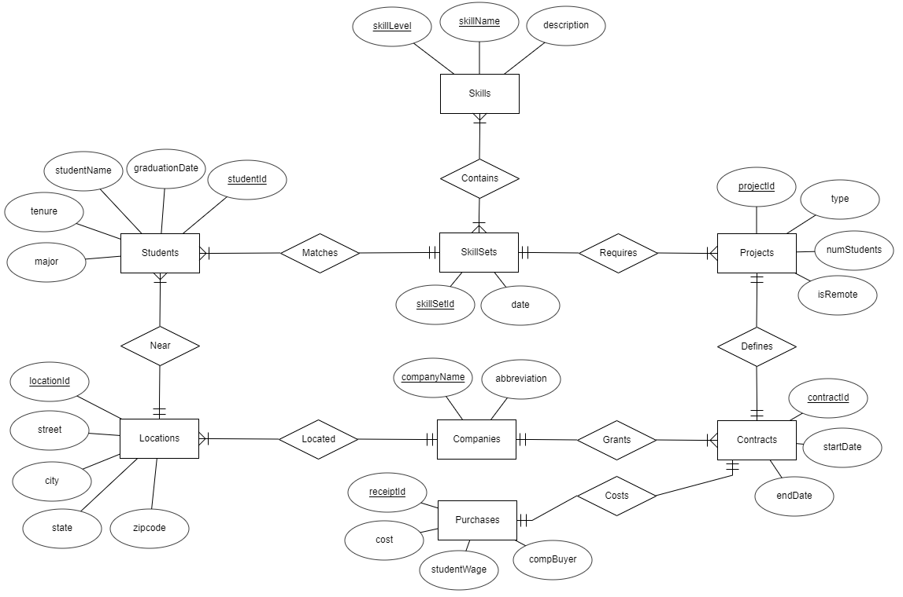
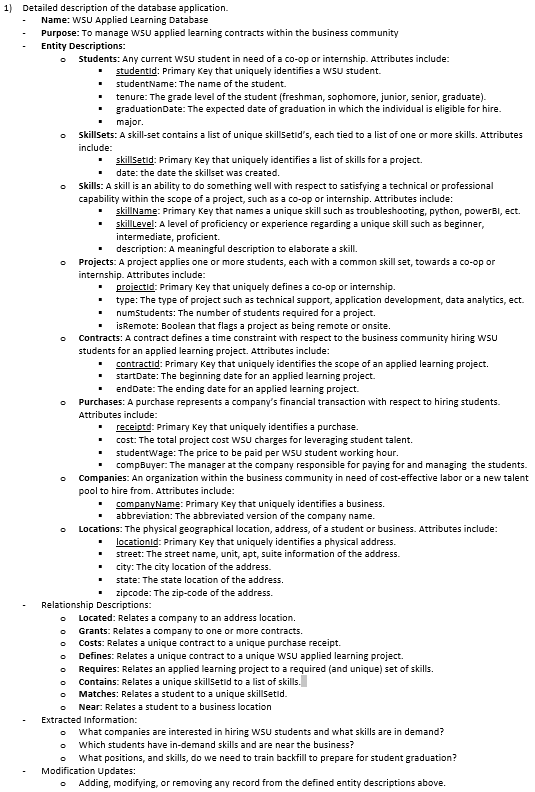
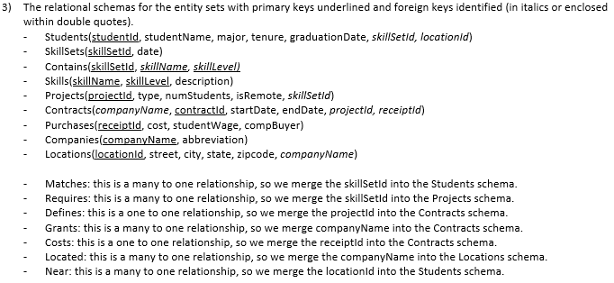

# WSU_ALDB
WSU Applied Learning Database
[](https://repl.it/github/WSUCS665/WSU_ALDB)


* This repository represents the Wichita State University Applied Learning database
* This repository is front-ended by [Repl.it](https://WSUALDB.wsucs665.repl.run)
* This repository supported by a serverless CICD build processes
* Flake8 linting, unittests, and coverage are enforced for quality.
* Compatible with Python 3.6.x, Windows, Linux, Mac


## CONTENTS
* [Documentation](#documentation)
* [ToDo](#todo)
* [Goals](#goals)
* [Installation](#Installation)
* [CICD](#cicd)
* [Contribute](#contribute)
* [Troubleshooting](#troubleshooting)

## Documentation
```javascript
The Entity Relationship Diagram and details for this repository are as follows.
```





## ToDo
```javascript
* Share the project with the team
* Add team mambers to the repository
* Design an implementation for the CS665 project
```


## Goals
```javascript
* What companies are interested in hiring WSU students and what skills are in demand?
* Which students have in-demand skills and are near the business?
* What positions, and skills, do we need to train backfill to prepare for student graduation?
```

## Installation
```javascript
First install python and pip because this program will automatically execute pip commands
to install packages based on how you use this repository. After you download or cloan this 
repository, use your commandline to change directory into the root folder and then do:
> python main.py

* Python3
* pip
```

## CICD
```javascript
This repository follows test driven development practices. In order to self-validate unittests,
and flake8 linting, in the root folder you can exectue (>python ./cicd/cicd_validation.py). 

Flake8 linting, unittest validation, and code coverage will then be analyzed. Expect github
to deny push/pull requests on protected branches if cicd_validation.py is not satisfied.

To automatically update the sphinx documentation and upload the wiki to a hosting service,
from within the root folder you can execute (>python ./cicd/sphinx_docgen.py).

Note: to execute sphinx_docgen.py you will need to set your .env in the root directory and
establish your own hosting service for the sphinx wiki.
```

## CONTRIBUTE
```javascript
This repository follows test driven development practices and the steps below define
the process to contribute future enhancements.

1: Clone the dev branch to your local workstation and change directory into the root folder

2: From the commandline create a new branch, examples include:
   git checkout -b feat/my_feature
   git checkout -b bug/some_bug
   git checkout -b wip/some_workinprogress

3: Pre validate your code by executing /cicd/cicd_valaidation.py
```

## Troubleshooting
```javascript
All unittest files located in the unit_tests directory can be debugged using /cicd/test_suite.py

Set your breakpoints anywhere in a unittest file located withn the unit_tests directory.
Then execute the /cicd/test_suite.py file using debug mode (Visual Studio Code) to enter and step
into your breakpoints. For each new unittest file that is added into the unit_tests
directory, be sure to add the respective import within test_suite.py
```
